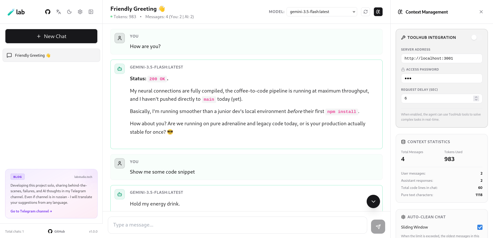
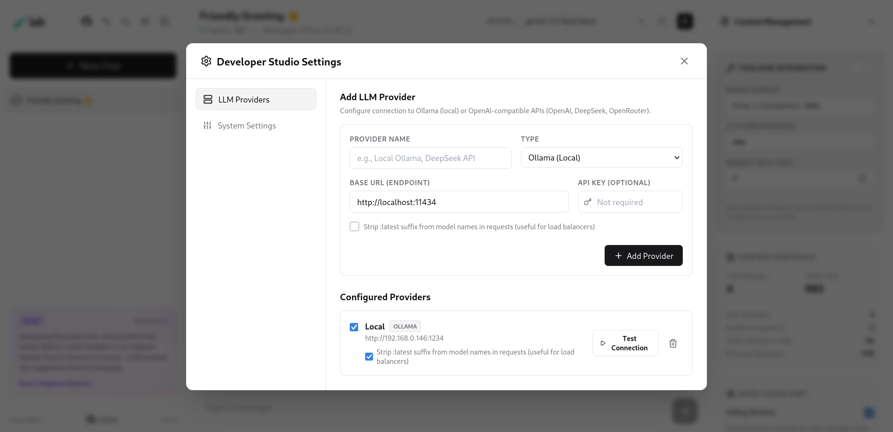
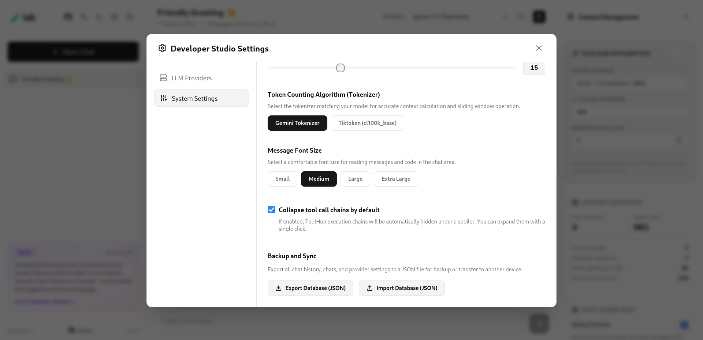

# 🧪lab

<p align="center">
  <b>English</b> | <a href="#russian-version">Русский</a> | <a href="#chinese-version">中文</a>
</p>

---

Minimalist, ultra-fast, and completely **serverless** alternative to heavy AI web interfaces like Open WebUI. 

No bulky Docker containers, no local databases to configure, no Python dependency hell, and no endless loading spinners. Just a clean, highly optimized static frontend that runs directly in your browser and stores everything locally.

Our built-in analytics are completely transparent and privacy-friendly — powered strictly by Cloudflare's free static pages analytics. If you prefer absolute privacy, you can run `🧪lab` locally via Bun, which completely eliminates any telemetry. Your API keys, settings, and chat history never leave your browser. This is our philosophy.

---

## 📸 Screenshots

<p align="center">
  
  
  
</p>

---

## 🆚 How 🧪lab compares to Open WebUI and Google AI Studio

| Criterion | 🧪lab | Open WebUI | Google AI Studio |
|---|---|---|---|
| Backend requirement | None — fully static, runs in the browser | FastAPI backend + SQLite/Postgres, typically Docker-deployed | Fully hosted by Google, no deployment at all |
| Data storage | Local IndexedDB, never leaves the browser | Server-side DB + optional vector store (Chroma/Milvus/Qdrant/pgvector) for RAG | Stored on Google's servers, tied to your Google account |
| Model providers | Ollama, OpenAI, Groq, OpenRouter, any OpenAI-compatible endpoint | Wide provider support, but configured server-side | Google Gemini models only |
| Deployment | Static build, deploy anywhere (Cloudflare Pages, Vercel, Nginx) or run fully offline | Docker container, Python dependency tree that breaks itself, DB provisioning | None needed, but none possible either — you don't control it |
| Context tooling | Live token tracking, message pinning, sliding-window auto-prune, code compression, GraphMem (GraphRAG) coming later | Context handled mostly via RAG pipeline (hard to set up), less granular manual control | Basic context window display (token count in conversation), no surgical pruning tools, no pinned messages (like in messengers) |
| Memory / knowledge base | Native GraphMem knowledge graph (CRUD, semantic retrieval, auto-ingestion) — coming soon | RAG over vector DBs, no native graph memory | No persistent memory beyond chat history (Google Drive only) |
| Agent / tool orchestration | Native ToolHub SDK, step-by-step execution inspection | Built-in function/tool calling pipeline (hard to figure out + Python) | Native Gemini function calling support, without any settings |
| Code editor | Monaco Editor (VS Code core) | Standard code block rendering | Standard code block rendering |
| Multi-user / enterprise | Single-user, local-first by design (can run in separate browser profiles or use chat export/import) | RBAC, SCIM, OAuth/OIDC — built for teams, requires a DevOps specialist to set up properly | Managed via Google account / Workspace, not self-hostable |

---

## 🔥 Why `🧪lab`?

*   **Zero Backend / Client-Full:** Everything runs strictly client-side. Your API keys and data live securely in your browser's local IndexedDB. *(Note: Local engines like Ollama require setting proper `OLLAMA_ORIGINS` due to browser CORS policies).*
*   **Multi-Provider & Fast Search:** Connect and switch between Ollama, OpenAI, Groq, OpenRouter, or any OpenAI-compatible endpoint. Quickly search through models and saved conversations with built-in instant filtering. Connect all of them at once.
*   **Surgical Context Control:** Real-time token tracking powered by `js-tiktoken` and the native Gemini tokenizer (~99% precision). Pin crucial messages, slice outdated history, or compress massive code blocks on the fly.
*   **Persistent Graph Memory (GraphMem):** Full native integration with GraphMem knowledge graph database. Automated context retrieval, multi-turn reasoning ingestion, graph statistics analytics, and full CRUD over knowledge graphs. Will be released to the public slightly later.
*   **Code-Centric Monaco Editor & Full LaTeX:** Code snippets are rendered with Microsoft Monaco Editor (VS Code core) featuring auto-height, one-click copy, and smart folding. Mathematical formulas, symbols, and equations are rendered natively via LaTeX.
*   **Voice Engine (STT & TTS):** Low-latency speech input (Push-To-Talk hotkeys, prompt insertion) and real-time sentence-level streaming TTS with auto-sanitization (strips code/math), speed slider (0.5x–2.0x), and agnostic API endpoints.
*   **ToolHub Agentic Orchestration:** Native support for tool calls and multi-step agent execution with execution step inspection and auto-throttling delay settings. [Learn more about ToolHub.](https://github.com/Talos-popcorn/toolhub)

---

## 🛠️ Tech Stack

*   **Runtime:** Bun (production build on Bun 1.3+)
*   **UI:** React 18 + Tailwind CSS + **shadcn/ui** + Lucide Icons
*   **Local Storage:** **Dexie.js** (IndexedDB engine)
*   **State Management:** **Zustand** (with persistent storage)
*   **Tokenization:** `js-tiktoken` & `@lenml/tokenizer-gemini`
*   **Code Editor & Math:** `@monaco-editor/react` & KaTeX / LaTeX renderer
*   **Integrations SDK:** Native SDKs for [ToolHub](https://github.com/Talos-popcorn/toolhub) & GraphMem

---

## 🚀 Quick Start

### 1. Install dependencies
```bash
bun install
```

### 2. Run development server
```bash
bun run dev
```

### 3. Build for production (Static HTML/JS/CSS)
```bash
bun run build
# Start:
bun run start
```
The build artifacts will be in `./dist`, ready for instant deployment on Cloudflare Pages, Vercel, Netlify, or any static file server (Nginx/Caddy).

---

## 💎 What's New & Release Highlights

### 🚀 v1.1.10 — Virtual Prefix Folders & Surgical Sidebar Analytics
*   **Virtual Prefix Radix-Tree:** Zero-overhead hierarchical folder grouping. Dialogs sharing a common prefix (e.g. `BeerBet / Backend / API`) automatically cluster into recursive, collapsible folders with visual guide-lines. No extra database tables or schema migrations needed.
*   **Folder Operations & Bulk Actions:** Instant batch renaming (replaces prefixes across all child threads) and cascade deletion of folders directly from the sidebar.
*   **Live Context Weight Badging:** Minimalist flat token badges for each conversation and aggregated totals for folders with continuous alpha-scaled color saturation based on sliding window budget.
*   **Customizable Clustering Limits:** Configurable minimum prefix length (1–15 chars) and minimum group size (2–10 threads) in Settings.
*   **Instant View Toggle:** Switch between hierarchical tree view (`📁`) and chronological timeline list (`📑`) with a single click.

### 📱 v1.1.9 — PWA, Mobile Adaptation & Native Notifications
*   **Full Mobile Ergonomics:** Complete mobile layout overhaul with safe-area insets support, touch-optimized sidebars, and responsive modal dialogues.
*   **Progressive Web App (PWA) & Service Worker:** Installable standalone app on iOS, Android, and desktop with background asset caching and offline boot.
*   **Native Web Push & WakeLock:** Real-time push notifications upon completion of long-running LLM completions and screen WakeLock preventing iOS/Android from sleeping mid-stream.
*   **ToolHub SDK Upgrades & Model Selector Fixes:** Hardened ToolHub agent loops and z-index fixes for floating model dropdowns.

---

## 💎 Core Architecture & Capabilities (v1.1.8)

### 1. Local-First Storage & Zero Migration Friction
*   Zero server-side databases. All providers, chat threads, messages, and model parameters persist in your browser's IndexedDB.
*   Fully offline-capable workspace (perfect for air-gapped setups with local LLMs).
*   One-click full JSON workspace backup and restore.

### 2. Deep Context Control & Analytics Panel
*   **Message Pinning:** Pin prompt anchors or critical rules — pinned messages are permanently immune to automated sliding window pruning and bulk cleanup actions.
*   **Sliding Window (Auto-Prune):** Set custom token thresholds (e.g. 16k, 80k, 128k). Once exceeded, unpinned messages are pruned in FIFO order.
*   **Surgical Cleaning Tools:** Prune top $N$ messages, keep only last $N$, remove heaviest token consumers, or compress all code blocks to placeholders while preserving text history.
*   **Context Analytics:** Live token breakdown between User, Assistant, Tool calls, and System instructions, response expansion ratio ($x\text{N}$), heaviest message inspection, and code language distribution.
*   **Granular Hyperparameters:** Per-chat control over Temperature, Top-P, Frequency Penalty, and Presence Penalty.

### 3. GraphMem Knowledge Graph Integration (Coming soon to the public)
*   **Semantic Context Injection:** Automatically queries GraphMem for relevant knowledge snippets based on user prompt and injects isolated `[GRAPHMEM_CONTEXT]` blocks (auto-stripped from historical prompts to save tokens).
*   **Smart Ingestion:** Asynchronously indexes user queries, model responses, and tool executions into semantic graph nodes and vector memory.
*   **Knowledge Graph CRUD:** Select existing graphs, create new ones, rename in sync with chat titles, inspect graph integrity/nodes/links statistics, or safely delete graphs directly from the sidebar.

### 4. Voice Engine (STT & TTS)
*   **Speech Input (STT):** Push-to-talk microphone hotkeys, duration validation, and instant textarea appending.
*   **Streaming Speech (TTS):** Real-time sentence-level audio queue with automatic code/math/emoji sanitization, 0.5x–2.0x speed control, and full support for local or remote audio APIs.

### 5. Developer Ergonomics
*   **LaTeX Math Rendering:** Native support for inline and block mathematical equations.
*   **Message Timestamps:** Optional ISO timestamp injection formatted in local UTC offsets.
*   **Chat Export:** Export complete threads into clean Markdown files with code formatting intact.
*   **Trilingual Support:** Instant switching between English, Russian, and Chinese (Simplified).

---

## ⚠️ Pragmatic Disclaimer & Philosophy

1.  **Built for Self-Use:** `🧪lab` was built to replace bloated, slow web frontends. It is strictly engineered around a fast daily workflow.
2.  **No Over-Engineered Dogmas:** The codebase is written to be clean, readable, performant, and maintainable. No redundant enterprise abstractions.
3.  **Respect to Google AI Studio:** Inspired by Google AI Studio's three-panel layout, `🧪lab` brings that developer-friendly workspace to any custom endpoint, open-weight model, or private API.

---

## 🌍 Zero Politics, Just Engineering

This project is a **neutral, peaceful engineering space**. We are completely offline from political games, conflicts, and regional disputes. Everyone is welcome as long as we focus on writing good software, building useful tools, and respecting each other as engineers.

---

## ⚖️ License & Commercial Use

This project is licensed under the **AGPL-3.0 License** — free for personal use, self-hosting, and open-source contributions.

**Commercial License:**
If your company wants to use `🧪lab` internally, modify it, or bundle it into proprietary commercial offerings without copyleft obligations of AGPL-3.0, you must obtain a commercial license. Contact: **collab@labstudio.tech**.

---

<a name="russian-version"></a>
# 🧪lab

<p align="center">
  <a href="#top">English</a> | <b>Русский</b> | <a href="#chinese-version">中文</a>
</p>

---

Минималистичная, ультрабыстрая и полностью **serverless** альтернатива перегруженным веб-интерфейсам для работы с ИИ вроде Open WebUI.

Никаких тяжелых Docker-контейнеров, локальных баз данных, питоновского ада зависимостей и бесконечных спиннеров. Чистый статический фронтенд, который работает прямо в браузере и хранит все данные локально.

Встроенная аналитика полностью прозрачна и безопасна — используется исключительно бесплатная статика Cloudflare Pages. Если вам важна абсолютная приватность, вы можете запустить `🧪lab` локально через Bun - в этом случае аналитики не будет вообще. Ваши ключи API и история чатов никогда не покидают браузер. Это наша философия.

---

## 📸 Скриншоты

<p align="center">
  
  
  
</p>

---

## 🆚 Чем 🧪lab отличается от Open WebUI и Google AI Studio

| Критерий | 🧪lab | Open WebUI | Google AI Studio |
|---|---|---|---|
| Нужен ли бэкенд | Не нужен - полностью статичен, работает в браузере | Нужен FastAPI-бэкенд + SQLite/Postgres, обычно через Docker | Полностью на серверах Google |
| Хранение данных | Локально в браузере (IndexedDB, никогда не покидает браузер) | На сервере + опционально векторная БД (Chroma/Milvus/Qdrant/pgvector) для RAG | На серверах Google, привязано к аккаунту |
| Провайдеры моделей | Ollama, OpenAI, Groq, OpenRouter, любой OpenAI-совместимый эндпоинт | Широкая поддержка провайдеров, но настройка на стороне сервера | Только модели Google |
| Деплой | Статическая сборка - куда угодно (Cloudflare Pages, Vercel, Nginx) или полностью офлайн | Docker-контейнер, Python-зависимости которые ломают друг друга, настройка БД | Разворачивать не нужно, но и невозможно - вне вашего контроля |
| Работа с контекстом | Живой счётчик токенов, закрепление сообщений, скользящее окно с авто-очисткой, сжатие кода, в дальнейшем - GraphMem (GraphRAG) | Контекст в основном через RAG-конвейер, который сложно подключить, меньше ручного контроля | Базовое отображение окна контекста (кол-во токенов в диалоге), нет инструментов точечной чистки, нет pinned-сообщений (закрепление сообщений, как в мессенджерах) |
| Память / база знаний | Нативный граф знаний GraphMem (CRUD, семантический поиск, авто-индексация) будет представлен несколько позже | RAG поверх векторных БД, нативной графовой памяти нет | Нет постоянной памяти сверх истории чата (только Google Drive) |
| Оркестрация агентов/тулов | Нативный ToolHub SDK, пошаговый просмотр выполнения | Встроенный конвейер вызова функций/тулов, в которых сложно разобраться, + Python | Поддержка function calling нативной для Gemini, без каких-либо настроек |
| Редактор кода | Monaco Editor (движок VS Code) | Стандартный рендер блоков кода | Стандартный рендер блоков кода |
| Многопользовательский режим | Однопользовательский, local-first по дизайну (можно открыть в разных профилях браузера, или пользоваться импортом-экспортом списка чатов) | RBAC, SCIM, OAuth/OIDC - рассчитан на команды, требует DevOps специалиста для грамотной настройки | Управляется только через аккаунт/Workspace Google, self-host невозможен |

---

## 🔥 Почему `🧪lab`?

*   **Zero Backend / Client-Full:** Всё выполняется исключительно на клиенте. Ключи API и переписки надежно хранятся в IndexedDB вашего браузера. *(Примечание: для локальных движков вроде Ollama требуется настроить `OLLAMA_ORIGINS` из-за CORS-политик браузера).*
*   **Мультипровайдерность и быстрый поиск:** Подключайте и параллельно переключайтесь между Ollama, OpenAI, Groq, OpenRouter или любыми OpenAI-совместимыми API. Мгновенный поиск по списку моделей и диалогов. Можно подключить хоть всех сразу.
*   **Хирургический контроль контекста:** Подсчет токенов в реальном времени (`js-tiktoken` и нативный токенайзер Gemini с точностью ~99%). Закрепление сообщений (Pin), умная срезка старой истории и сжатие тяжелого кода налету.
*   **Графовая память знаний (GraphMem):** Полная нативная интеграция с базой знаний GraphMem. Автоматическое извлечение релевантных контекстных сниппетов, индексация диалога и вызовов инструментов, просмотр статистики графа и полноценный CRUD графов памяти. Будет представлена общественности несколько позже.
*   **Кодоцентричный Monaco Editor и LaTeX:** Блоки кода рендерятся на движке VS Code (Monaco Editor) с автовысотой, умным копированием и сворачиванием. Математические формулы отображаются нативно через LaTeX.
*   **Voice Engine (STT & TTS):** Голосовой ввод (Push-To-Talk хоткеи, впрыск в промпт) и потоковая озвучка ответов в реальном времени с очисткой от кода/формул, регулятором скорости (0.5x–2.0x) и поддержкой любых аудио-провайдеров.
*   **Оркестрация агентов через ToolHub:** Поддержка выполнения внешних инструментов моделью, пошаговый просмотр шагов выполнения и настраиваемая пауза между итерациями. [Подробнее о ToolHub.](https://github.com/Talos-popcorn/toolhub)

---

## 🛠️ Технологический стек

*   **Среда выполнения:** Bun (production build на базе Bun 1.3+)
*   **UI:** React 18 + Tailwind CSS + **shadcn/ui** + Lucide Icons
*   **Локальное хранилище:** **Dexie.js** (IndexedDB)
*   **Стейт-менеджер:** **Zustand** (с локальным сохранением состояния)
*   **Токенизация:** `js-tiktoken` и нативный токенайзер Gemini
*   **Редактор кода и формулы:** `@monaco-editor/react` & KaTeX / LaTeX
*   **Интеграции:** Нативные SDK для [ToolHub](https://github.com/Talos-popcorn/toolhub) и GraphMem

---

## 🚀 Быстрый старт

### 1. Установка зависимостей
```bash
bun install
```

### 2. Запуск в режиме разработки
```bash
bun run dev
```

### 3. Сборка для продакшена (Статический HTML/JS/CSS)
```bash
bun run build
# Запуск:
bun run start
```
Результат сборки появится в папке `./dist` — готов к мгновенному деплою на Cloudflare Pages, Vercel, Netlify или Nginx.

---

## 💎 Что нового и ключевые обновления

### 🚀 v1.1.10 — Виртуальные папки по префиксам и хирургическая аналитика сайдбара
*   **Древовидная группировка по префиксам (Radix-Tree):** Автоматическое сбивание диалогов с общим префиксом (например, `BeerBet / Backend / API`) во вложенные сворачиваемые папки с направляющими линиями дерева без усложнения БД и лишних миграций.
*   **Массовое управление папками:** Пакетное переименование префикса сразу во всей ветке диалогов и каскадное удаление папок в один клик.
*   **Чистая индикация веса контекста:** Лаконичный моноширинный счетчик токенов у каждого диалога и суммарный вес папок с плавной альфа-шкалой насыщенности относительно лимита скользящего окна.
*   **Гибкая настройка группировки:** Настраиваемая минимальная длина префикса (от 1 до 15 символов) и минимальный размер группы (от 2 до 10 чатов) в модалке настроек.
*   **Мгновенный тумблер режимов:** Быстрое переключение между древовидной структурой (`📁`) и хронологическим плоским списком (`📑`).

### 📱 v1.1.9 — PWA, мобильная адаптация и нативные пуши
*   **Мобильная адаптация:** Полностью переработанный UI для смартфонов и планшетов с поддержкой safe-area insets на iOS и удобными тач-шторками сайдбаров.
*   **PWA и Service Worker:** Поддержка установки приложения как нативного PWA на iOS, Android и десктоп с кэшированием и офлайн-запуском.
*   **Нативные пуш-уведомления и WakeLock:** Фоновые уведомления об окончании длинных генераций при свернутом окне и предотвращение засыпания экрана (Screen WakeLock) во время стриминга.
*   **Обновление ToolHub SDK:** Стабилизация циклов агента ToolHub и исправление z-index всплывающего селектора моделей.

---

## 💎 Архитектура и базовые возможности (v1.1.8)

### 1. Local-First и бесшовная совместимость
*   Полное отсутствие внешних БД: провайдеры, чаты, сообщения и настройки хранятся в IndexedDB браузера.
*   Автономная работа без интернета (при использовании локальных моделей Ollama).
*   Экспорт и импорт полной резервной копии всех данных в один JSON-файл.

### 2. Продвинутый контроль контекста и аналитика
*   **Закрепление сообщений (Pins):** Закрепляйте важные системные правила или промпты — закрепленные сообщения защищены от удаления скользящим окном и массовой очисткой.
*   **Скользящее окно (Auto-Prune):** Задавайте порог токенов (16k, 80k, 128k и т.д.). При его превышении старые незакрепленные сообщения автоматически удаляются.
*   **Инструменты очистки:** Удаление первых $N$ сообщений, сохранение только последних $N$, срезка самых тяжелых по токенам реплик или автосжатие кода.
*   **Глубокая аналитика чата:** Наглядное соотношение токенов (User, Assistant, System, Tools), коэффициент расширения ответа ($x\text{N}$), выявление самого тяжелого сообщения и распределение языков программирования.
*   **Гиперпараметры генерации:** Индивидуальная настройка Temperature, Top-P, Frequency Penalty и Presence Penalty для каждого диалога.

### 3. Интеграция с GraphMem (Графовая долговременная память - будет представлена общественности несколько позже)
*   **Семантическое подтягивание контекста:** Автоматический поиск по графу знаний перед отправкой запроса и внедрение блока `[GRAPHMEM_CONTEXT]` (автоматически удаляется из старых сообщений истории для экономии токенов).
*   **Индексация знаний:** Автоматическая отправка запросов юзера, ответов модели и вызовов инструментов в векторное и графовое хранилище.
*   **CRUD графов памяти:** Выбор существующих графов из списка, создание новых, синхронное переименование при смене названия чата и просмотр метрик целостности графа.

### 4. Voice Engine (STT & TTS)
*   **Голосовой ввод (STT):** Запись с микрофона по зажатию клавиши, проверка длительности и мгновенная подстановка в поле ввода.
*   **Потоковый синтез (TTS):** Озвучка ответов прямо из стрима по предложениям с автоочисткой от кода/формул, регулировкой скорости (0.5x–2.0x) и полным абстрагированием от провайдера.

### 5. Удобство разработки
*   **Поддержка LaTeX:** Корректный рендеринг строчных и блочных математических формул.
*   **Таймстампы сообщений:** Возможность включить передачу временных меток с точным UTC-смещением в модель.
*   **Экспорт чатов:** Выгрузка всего диалога в чистый Markdown-файл.
*   **Трехъязычный интерфейс:** Мгновенное переключение между English, Русский и 中文.

---

## ⚠️ Прагматичный дисклеймер и философия

1.  **Создано для себя:** `🧪lab` написан как практичный инструмент для ежедневной разработки взамен медленным и тяжеловесным интерфейсам.
2.  **Без лишних усложнений:** Код простой, понятный и ориентирован на производительность. Никаких избыточных enterprise-паттернов.
3.  **Уважение к Google AI Studio:** Макет интерфейса вдохновлен элегантной трехпанельной структурой Google AI Studio, перенесенной в независимый клиент для любых моделей и провайдеров.

---

## 🌍 Вне политики, только инженерия

Этот проект — **нейтральное, мирное инженерное пространство**. Мы полностью изолированы от политических игр, войн и конфликтов. Здесь рады всем, кто сфокусирован на написании качественного кода и взаимном уважении.

---

## ⚖️ Лицензия и коммерческое использование

Проект распространяется под лицензией **AGPL-3.0** (бесплатен для личного использования и open-source модификаций).

**Для коммерческого использования:**
Для использования `🧪lab` внутри закрытых корпоративных контуров или проприетарных продуктов без ограничений AGPL-3.0 требуется коммерческая лицензия. Почта для связи: **collab@labstudio.tech**.

---

<a name="chinese-version"></a>
# 🧪lab

<p align="center">
  <a href="#top">English</a> | <a href="#russian-version">Русский</a> | <b>中文</b>
</p>

---

极简、超快且完全 **无服务器 (Serverless)** 的现代 AI Web 客户端，是 Open WebUI 等臃肿方案的高性能替代品。

无需庞大的 Docker 容器，无需配置后端数据库，远离 Python 依赖地狱与漫长的加载动画。纯净高效的静态前端，直接在浏览器中运行，并将全部数据本地化存储。

内置统计完全透明且隐私安全（基于 Cloudflare Pages 静态分析）。如需绝对隐私，可通过 Bun 在本地运行，彻底杜绝任何网络分析。您的 API 密钥和聊天记录绝不会离开浏览器。这是我们的宗旨。

---

## 📸 界面截图

<p align="center">
  
  
  
</p>

---

## 🆚 🧪lab 与 Open WebUI、Google AI Studio 的对比

| 对比项 | 🧪lab | Open WebUI | Google AI Studio |
|---|---|---|---|
| 是否需要后端 | 不需要 — 完全静态，浏览器直接运行 | 需要 FastAPI 后端 + SQLite/Postgres，通常通过 Docker 部署 | 完全由 Google 托管，无需任何部署 |
| 数据存储 | 本地 IndexedDB，数据永不离开浏览器 | 服务器端数据库 + 可选向量库（Chroma/Milvus/Qdrant/pgvector）用于 RAG | 存储在 Google 服务器上，与 Google 账号绑定 |
| 模型供应商 | Ollama、OpenAI、Groq、OpenRouter，任意 OpenAI 兼容端点 | 支持众多供应商，但需在服务端配置 | 仅支持 Google Gemini 模型 |
| 部署方式 | 静态构建，可部署至任意平台（Cloudflare Pages、Vercel、Nginx）或完全离线运行 | Docker 容器、Python 依赖项常常相互冲突、需配置数据库 | 无需部署，但也无法自行部署 — 完全不受你控制 |
| 上下文管理 | 实时 Token 统计、消息置顶、滑动窗口自动清理、代码块压缩，后续将推出 GraphMem (GraphRAG) | 上下文主要通过 RAG 流程处理（难以设置），人工精细控制较少 | 仅基础上下文窗口显示（对话中的 Token 数量），无精细清理工具，无置顶消息功能（类似于即时通讯软件中的置顶） |
| 记忆 / 知识库 | 原生 GraphMem 知识图谱（CRUD、语义检索、自动索引）将在稍后推出 | 基于向量数据库的 RAG，无原生图谱记忆 | 除聊天历史外无持久记忆（仅限 Google Drive） |
| 智能体 / 工具编排 | 原生 ToolHub SDK，支持逐步执行追踪 | 内置函数/工具调用流程（难以理解，且依赖 Python） | Gemini 原生支持函数调用，无需任何设置 |
| 代码编辑器 | Monaco Editor（VS Code 核心） | 标准代码块渲染 | 标准代码块渲染 |
| 多用户 / 企业级 | 单用户，本地优先设计（可在不同浏览器配置文件中打开，或通过导出/导入聊天列表进行管理） | 支持 RBAC、SCIM、OAuth/OIDC — 面向团队，需要专业的 DevOps 人员进行配置 | 通过 Google 账号/Workspace 管理，无法自托管 |

---

## 🔥 为什么选择 `🧪lab`？

*   **纯前端客户端 (Client-Full):** 一切均在浏览器本地运行。API 密钥和历史记录安全保存在 IndexedDB 中。*(注意：由于浏览器 CORS 安全策略，本地 Ollama 引擎需要配置正确的 `OLLAMA_ORIGINS`)*。
*   **多模型供应商与快速检索:** 同时接入并无缝切换 Ollama、OpenAI、Groq、OpenRouter 或任何兼容 OpenAI 协议的端点。支持对模型和历史对话进行即时搜索。甚至可以同时连接所有服务商。
*   **精准上下文控制:** 实时 Token 计数（支持 `js-tiktoken` 和原生 Gemini Tokenizer，准确率高达 99%）。支持消息置顶 (Pin)、滑动窗口自动裁剪及代码块智能折叠。
*   **GraphMem 知识图谱记忆:** 原生集成 GraphMem 知识图谱数据库。支持上下文自动检索、多轮推理记忆摄入、图谱拓扑统计及完整的图谱 CRUD 管理。将在稍后向公众推出。
*   **以代码为核心的 Monaco 编辑器与 LaTeX 支持:** 采用 VS Code 同款 Monaco 编辑器渲染代码块，具备自适应高度和一键复制代码功能。数学公式由 LaTeX/KaTeX 原生完美渲染。
*   **Voice Engine 语音引擎 (STT & TTS):** 低延迟麦克风输入（快捷键录音、直接注入 Prompt）与流式实时朗读，支持代码/公式净化、0.5x–2.0x 语速调节及兼容任意 OpenAI 协议端点。
*   **ToolHub 智能体协同:** 支持模型工具调用 (Tool Calls)，具备多步执行追踪与自定义调用间隔延时。[了解更多关于 ToolHub 的信息。](https://github.com/Talos-popcorn/toolhub)

---

## 🛠️ 技术栈

*   **运行时:** Bun (基于 Bun 1.3+ 生产构建)
*   **UI 架构:** React 18 + Tailwind CSS + **shadcn/ui** + Lucide Icons
*   **本地存储:** **Dexie.js** (IndexedDB 封装)
*   **状态管理:** **Zustand** (支持持久化)
*   **分词器 (Tokenizers):** `js-tiktoken` & `@lenml/tokenizer-gemini`
*   **编辑器与公式:** `@monaco-editor/react` & KaTeX / LaTeX
*   **集成 SDK:** 原生 [ToolHub](https://github.com/Talos-popcorn/toolhub) SDK 与 GraphMem SDK

---

## 🚀 快速上手

### 1. 安装依赖
```bash
bun install
```

### 2. 启动开发服务器
```bash
bun run dev
```

### 3. 构建生产包 (静态 HTML/JS/CSS)
```bash
bun run build
# 启动服务器:
bun run start
```
构建产物输出至 `./dist` 目录，可直接部署至 Cloudflare Pages、Vercel、Netlify 或任何 Nginx/静态文件服务器。

---

## 💎 最新特性与版本更新

### 🚀 v1.1.10 — 基于前缀的虚拟文件夹与侧边栏 Token 深度分析
*   **基于前缀的虚拟 Radix-Tree 目录树:** 共享相同前缀（例如 `BeerBet / Backend / API`）的对话将自动聚合为可递归折叠的嵌套文件夹，具备直观的树状引导线。零额外数据库开销，无需进行任何架构迁移。
*   **文件夹批量管理与操作:** 支持在侧边栏直接对整个文件夹进行一键批量前缀重命名及级联删除。
*   **极简 Context 权重视觉反馈:** 对话与文件夹均配备纯文本单色 Token 计数徽标，颜色饱和度依据滑动窗口限制进行平滑的 Alpha 通道渐变。
*   **灵活的聚合参数配置:** 可在设置中自由配置构成文件夹所需的最小前缀长度（1–15 字符）与最小对话数量（2–10 个）。
*   **即时视图切换:** 支持一键在树状文件夹视图 (`📁`) 与时间线平铺列表 (`📑`) 之间无缝切换。

### 📱 v1.1.9 — PWA 支持、移动端全适配与原生推送
*   **全移动端适配:** 针对移动设备全面优化，完美适配 iOS 安全区域 (Safe Area Insets) 及触控侧边栏手势。
*   **PWA 与 Service Worker:** 支持在 iOS、Android 和桌面端作为独立应用安装，具备离线资产缓存能力。
*   **系统级原生推送与屏幕常亮 (WakeLock):** 在应用处于后台时发送生成完成通知，流式生成期间自动调用 WakeLock 防止设备休眠断网。
*   **ToolHub SDK 升级与下拉层级修复:** 强化智能体执行循环并修复模型选择框的 z-index 层级问题。

---

## 💎 核心架构与基础能力 (v1.1.8)

### 1. 本地优先与零迁移负担
*   完全免除后端数据库：所有服务商、对话、消息及模型参数均安全保存在浏览器本地 IndexedDB。
*   支持完全离线使用（与本地 Ollama 配合使用时无需外网）。
*   支持完整工作区数据的一键导出与导入 (JSON)。

### 2. 深度上下文控制与分析面板
*   **消息置顶 (Pin):** 固定重要规则或 Prompt 锚点，置顶消息在滑动窗口或批量清理时受保护不会被删除。
*   **滑动窗口 (Auto-Prune):** 自定义上下文 Token 上限（如 16k, 80k, 128k）。超出上限时按时间顺序自动清理未置顶的历史消息。
*   **精准清理工具:** 支持删除最早 $N$ 条、仅保留最后 $N$ 条、按 Token 消耗清理或将所有代码块压缩为占位符。
*   **上下文深度分析:** 直观展示用户、助手、工具与系统 Token 占比，输出膨胀率 ($x\text{N}$)，最大消息定位及代码语言分布。
*   **模型超参数微调:** 支持为每个独立对话单独调节 Temperature、Top-P、Frequency Penalty 和 Presence Penalty。

### 3. GraphMem 知识图谱记忆系统（即将在后续更新中向公众推出）
*   **语义上下文注入:** 在发送消息前自动检索 GraphMem 图谱知识，注入隔离的 `[GRAPHMEM_CONTEXT]` 块（并在后续历史中自动剔除以节省 Token）。
*   **自动知识沉淀:** 异步将用户提问、模型回答及工具调用步骤索引至向量与图谱数据库中。
*   **知识图谱 CRUD:** 支持从下拉列表选择已有图谱、一键创建新图谱、与聊天标题同步重命名以及图谱完整性统计分析。

### 4. Voice Engine 语音引擎 (STT & TTS)
*   **语音输入 (STT):** 快捷键 Push-to-talk 录音、录音时长校验与 Prompt 输入框直接追加。
*   **流式合成 (TTS):** 句级实时流式朗读，送入前自动净化代码与公式，支持 0.5x–2.0x 语速调节及本地/远程语音 API 无缝接入。

### 5. 开发者体验优化
*   **完整 LaTeX 支持:** 原生支持行内与块级数学公式渲染。
*   **时间戳附带:** 可选向模型发送附带本地 UTC 时区偏移的精确时间戳。
*   **对话导出:** 一键将当前对话导出为排版规范的 Markdown 文件。
*   **三语支持:** 支持在 English、Русский 和 中文 (简体) 之间即时无缝切换。

---

## ⚠️ 务实声明与理念

1.  **为效率而生:** `🧪lab` 旨在提供轻量、极致响应的开发体验，彻底摆脱臃肿笨重的传统 Web 客户端。
2.  **摒弃过度设计:** 代码结构保持清晰、务实、高效，注重核心性能与用户体验。
3.  **致敬 Google AI Studio:** 界面布局借鉴了 Google AI Studio 经典的三栏设计，并将其扩展至全生态自定义端点与本地开源大模型。

---

## 🌍 专注于工程，远离纷争

本项目是一个**纯粹、和平的工程技术空间**。我们完全远离政治纷争与地区冲突。我们欢迎所有专注于编写优秀代码、构建实用工具并互相尊重的开发者。

---

## ⚖️ 开源协议与商业授权

本项目基于 **AGPL-3.0 开源协议** — 个人使用、私有化部署及开源贡献完全免费。

**企业与商业用途:**
若企业计划在内部商业环境中使用、修改或集成到闭源商业产品中且不希望受 AGPL-3.0 开源传染性约束，必须获取商业授权。联系邮箱: **collab@labstudio.tech**。

---

*Made with ☕, focus, and a strong preference for fast, lightweight software.*